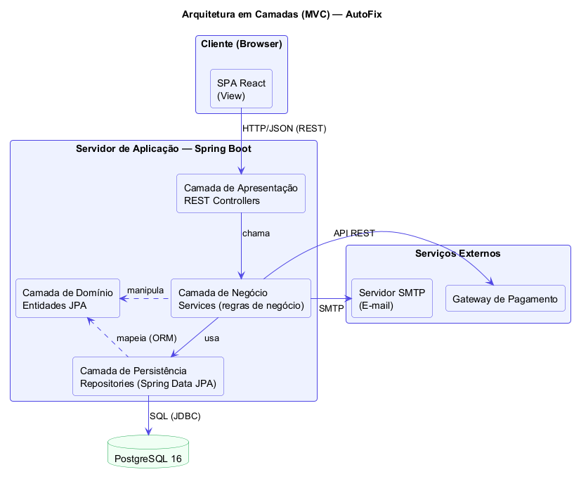

# 🔧 AutoFix — Sistema de Gestão de Oficina Mecânica

> [!NOTE]
> Projeto de sistema (apenas **projeto / diagramação / arquitetura** — sem implementação de código)
> elaborado individualmente para a disciplina **Projeto de Software**.
> Toda a modelagem foi produzida com **PlantUML**.

<table>
  <tr>
    <td width="760px">
      <div align="justify">
        O <b>AutoFix</b> é um sistema fictício de gestão para oficinas mecânicas de pequeno e médio porte.
        Ele informatiza o ciclo completo de atendimento: agendamento, abertura de Ordem de Serviço (OS),
        diagnóstico e orçamento, aprovação pelo cliente, execução dos serviços com baixa de peças em estoque,
        pagamento (dinheiro ou eletrônico via gateway) e notificações por e-mail em todas as etapas.
        O gerente acompanha a operação por relatórios de faturamento, produtividade e estoque.
      </div>
    </td>
  </tr>
</table>

---

## 🚧 Status do Projeto


> ⚠️ **Não é necessário desenvolver o código** — este repositório contém apenas o projeto,
> a diagramação e a arquitetura do sistema.

---

## 📚 Sumário

- [Sobre o Projeto](#-sobre-o-projeto)
- [Funcionalidades](#-funcionalidades)
- [Tecnologias (Stack Proposta)](#-tecnologias-stack-proposta)
- [Arquitetura](#-arquitetura)
- [Diagramas UML (PlantUML)](#-diagramas-uml-plantuml)
- [Documentação](#-documentação)
- [Estrutura de Pastas](#-estrutura-de-pastas)
- [Autores](#-autores)
- [Licença](#-licença)

---

## 📝 Sobre o Projeto

**Regras de negócio escolhidas: oficina mecânica.**

O fluxo central do AutoFix é a **Ordem de Serviço**:

1. O **cliente** agenda um atendimento para o seu veículo (UC-01);
2. O **atendente** cadastra cliente/veículo e abre a OS (UC-02, UC-03);
3. O **mecânico** registra o diagnóstico e emite o orçamento — o cliente é notificado por e-mail (UC-04);
4. O **cliente** aprova ou recusa o orçamento (UC-05);
5. O **mecânico** executa os serviços aprovados e registra as peças utilizadas, com baixa de estoque (UC-06, UC-07);
6. O **atendente** finaliza a OS e registra o pagamento — eletrônico via **gateway de pagamento** ou em dinheiro — e a nota é enviada por e-mail (UC-08);
7. O **gerente** acompanha tudo por relatórios gerenciais (UC-10).

---

## ✨ Funcionalidades

### 👤 Cliente
- Agendamento de atendimento com escolha de data/horário
- Aprovação ou recusa de orçamentos
- Consulta do histórico completo de manutenções do veículo
- Notificações por e-mail (orçamento emitido, serviço concluído, nota de pagamento)

### 🧑‍💼 Atendente
- Cadastro de clientes e veículos
- Abertura de Ordens de Serviço
- Gestão da agenda da oficina
- Finalização de OS e registro de pagamento

### 🔩 Mecânico
- Registro de diagnóstico e emissão de orçamento (serviços + peças)
- Execução dos itens de serviço aprovados
- Registro de peças utilizadas com baixa automática de estoque

### 📊 Gerente
- Manutenção do catálogo de serviços e do estoque de peças
- Relatórios de faturamento, produtividade dos mecânicos e posição de estoque

---

## 🛠 Tecnologias (Stack Proposta)

> Informações **fictícias** de projeto — definem a stack alvo caso o sistema fosse implementado.

| Tecnologia | Versão | Finalidade |
|---|---|---|
| Java | 21 | Linguagem do back-end |
| Spring Boot | 3.5 | Framework principal (API REST) |
| Spring Data JPA / Hibernate | 6.x | Persistência (ORM) |
| Spring Security | 6.x | Autenticação e autorização |
| React | 19 | SPA do front-end |
| PostgreSQL | 16 | Banco de dados relacional |
| Docker / Docker Compose | — | Contêineres (nginx + api + db) |
| Nginx | — | Proxy reverso e estáticos |
| PlantUML | — | Diagramação UML |
| Maven | 3.9 | Build do back-end |

---

## 🏗 Arquitetura

Arquitetura **em camadas (MVC)**: SPA React → API REST (Controllers) → Services → Repositories → PostgreSQL,
com integrações externas (gateway de pagamento e SMTP) acessadas apenas pela camada de negócio.
Implantação em contêineres Docker num servidor cloud.



---

## 📐 Diagramas UML (PlantUML)

| Diagrama | Fonte | Imagem |
|---|---|---|
| Casos de Uso | [`casos-de-uso.puml`](diagramas/casos-de-uso.puml) | [`casos-de-uso.png`](diagramas/casos-de-uso.png) |
| DSS — UC-01 Agendar Atendimento | [`dss-uc01-agendar-atendimento.puml`](diagramas/dss-uc01-agendar-atendimento.puml) | [`dss-uc01-agendar-atendimento.png`](diagramas/dss-uc01-agendar-atendimento.png) |
| DSS — UC-05 Aprovar Orçamento | [`dss-uc05-aprovar-orcamento.puml`](diagramas/dss-uc05-aprovar-orcamento.puml) | [`dss-uc05-aprovar-orcamento.png`](diagramas/dss-uc05-aprovar-orcamento.png) |
| DSS — UC-08 Finalizar OS | [`dss-uc08-finalizar-os.puml`](diagramas/dss-uc08-finalizar-os.puml) | [`dss-uc08-finalizar-os.png`](diagramas/dss-uc08-finalizar-os.png) |
| Arquitetura (camadas) | [`arquitetura.puml`](diagramas/arquitetura.puml) | [`arquitetura.png`](diagramas/arquitetura.png) |
| Componentes | [`componentes.puml`](diagramas/componentes.puml) | [`componentes.png`](diagramas/componentes.png) |
| Implantação | [`implantacao.puml`](diagramas/implantacao.puml) | [`implantacao.png`](diagramas/implantacao.png) |
| Classes | [`classes.puml`](diagramas/classes.puml) | [`classes.png`](diagramas/classes.png) |
| Sequência — UC-05 | [`seq-uc05-aprovar-orcamento.puml`](diagramas/seq-uc05-aprovar-orcamento.puml) | [`seq-uc05-aprovar-orcamento.png`](diagramas/seq-uc05-aprovar-orcamento.png) |
| Sequência — UC-08 | [`seq-uc08-finalizar-os.puml`](diagramas/seq-uc08-finalizar-os.puml) | [`seq-uc08-finalizar-os.png`](diagramas/seq-uc08-finalizar-os.png) |
| Comunicação — UC-01 | [`comunicacao-uc01.puml`](diagramas/comunicacao-uc01.puml) | [`comunicacao-uc01.png`](diagramas/comunicacao-uc01.png) |
| Comunicação — UC-05 | [`comunicacao-uc05.puml`](diagramas/comunicacao-uc05.puml) | [`comunicacao-uc05.png`](diagramas/comunicacao-uc05.png) |
| Estados — Ordem de Serviço | [`estados-ordem-servico.puml`](diagramas/estados-ordem-servico.puml) | [`estados-ordem-servico.png`](diagramas/estados-ordem-servico.png) |
| Modelo de Dados (ER) | [`modelo-er.puml`](diagramas/modelo-er.puml) | [`modelo-er.png`](diagramas/modelo-er.png) |

> Para editar os arquivos `.puml`, use o plugin **PlantUML** no VS Code (`Alt+D` para preview)
> ou o site [plantuml.com](https://plantuml.com/). As imagens foram geradas via `plantuml -tpng`.

---

## 📄 Documentação

A **Documentação de Projeto completa** (atores, casos de uso, DSS, contratos de operação,
arquitetura, componentes/implantação, classes, sequência, comunicação, estados e modelo de dados)
está em [`documentacao-projeto.html`](documentacao-projeto.html) — basta abrir no navegador
(os diagramas estão embutidos no arquivo).

> 🌐 **Versão online (GitHub Pages):**
> [https://gustavofirmino.github.io/trabalho2-projeto-software/documentacao-projeto.html](https://gustavofirmino.github.io/trabalho2-projeto-software/documentacao-projeto.html)

---

## 📂 Estrutura de Pastas

```
trabalho2-projeto-software/
├── README.md                       # Este arquivo
├── documentacao-projeto.html       # Documentação de Projeto (template preenchido)
├── gerar_html.py                   # Script que gera o HTML com os diagramas embutidos
└── diagramas/                      # Fontes PlantUML (.puml) + imagens geradas (.png)
    ├── casos-de-uso.puml / .png
    ├── dss-uc01-agendar-atendimento.puml / .png
    ├── dss-uc05-aprovar-orcamento.puml / .png
    ├── dss-uc08-finalizar-os.puml / .png
    ├── arquitetura.puml / .png
    ├── componentes.puml / .png
    ├── implantacao.puml / .png
    ├── classes.puml / .png
    ├── seq-uc05-aprovar-orcamento.puml / .png
    ├── seq-uc08-finalizar-os.puml / .png
    ├── comunicacao-uc01.puml / .png
    ├── comunicacao-uc05.puml / .png
    ├── estados-ordem-servico.puml / .png
    └── modelo-er.puml / .png
```

---

## 👥 Autores

| 👤 Nome | :octocat: GitHub | 💼 LinkedIn |
|---|---|---|
| Gustavo Pessoa Firmino Duarte | [gustavofirmino](https://github.com/gustavofirmino) | [gustavofirmino](https://www.linkedin.com/in/gustavofirmino) |

> **PUC Minas — Engenharia de Software**
> Disciplina: Projeto de Software — Trabalho individual

---

## 📄 Licença

Este projeto está distribuído sob a licença **MIT**.

---

<div align="center">
  <sub>Projeto conceitual diagramado com 🌿 PlantUML — PUC Minas, 2026</sub>
</div>
